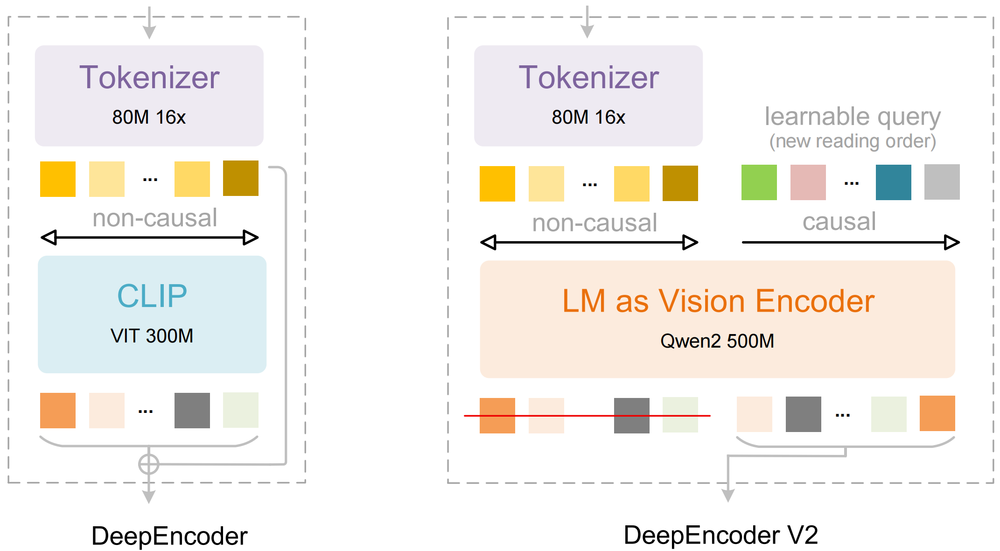

<!-- markdownlint-disable first-line-h1 -->
<!-- markdownlint-disable html -->
<!-- markdownlint-disable no-duplicate-header -->


<div align="center">
  
</div>


<hr>
<div align="center">
  <a href="https://www.deepseek.com/" target="_blank">
    
  </a>
  <a href="https://huggingface.co/deepseek-ai/DeepSeek-OCR-2" target="_blank">
    
  </a>

</div>

<div align="center">

  <a href="https://discord.gg/Tc7c45Zzu5" target="_blank">
    
  </a>
  <a href="https://twitter.com/deepseek_ai" target="_blank">
    
  </a>

</div>


<p align="center">
  <a href="https://huggingface.co/deepseek-ai/DeepSeek-OCR-2"><b>📥 Model Download</b></a> |
  <a href="https://github.com/deepseek-ai/DeepSeek-OCR-2/blob/main/DeepSeek_OCR2_paper.pdf"><b>📄 Paper Link</b></a> |
  <a href="https://arxiv.org/abs/2601.20552"><b>📄 Arxiv Paper Link</b></a> |
</p>

<h2>
<p align="center">
  <a href="">DeepSeek-OCR 2: Visual Causal Flow</a>
</p>
</h2>

<p align="center">

</p>
<p align="center">
<a href="">Explore more human-like visual encoding.</a>       
</p>


## Contents
- [Install](#install)
- [vLLM Inference](#vllm-inference)
- [Transformers Inference](#transformers-inference)
  


## Install
>Our environment is cuda11.8+torch2.6.0.
1. Clone this repository and navigate to the DeepSeek-OCR-2 folder
```bash
git clone https://github.com/deepseek-ai/DeepSeek-OCR-2.git
```
2. Conda
```Shell
conda create -n deepseek-ocr2 python=3.12.9 -y
conda activate deepseek-ocr2
```
3. Packages

- download the vllm-0.8.5 [whl](https://github.com/vllm-project/vllm/releases/tag/v0.8.5) 
```Shell
pip install torch==2.6.0 torchvision==0.21.0 torchaudio==2.6.0 --index-url https://download.pytorch.org/whl/cu118
pip install vllm-0.8.5+cu118-cp38-abi3-manylinux1_x86_64.whl
pip install -r requirements.txt
pip install flash-attn==2.7.3 --no-build-isolation
```
**Note:** if you want vLLM and transformers codes to run in the same environment, you don't need to worry about this installation error like: vllm 0.8.5+cu118 requires transformers>=4.51.1

## vLLM-Inference
- VLLM:
>**Note:** change the INPUT_PATH/OUTPUT_PATH and other settings in the DeepSeek-OCR2-master/DeepSeek-OCR2-vllm/config.py
```Shell
cd DeepSeek-OCR2-master/DeepSeek-OCR2-vllm
```
1. image: streaming output
```Shell
python run_dpsk_ocr2_image.py
```
2. pdf: concurrency (on-par speed with DeepSeek-OCR)
```Shell
python run_dpsk_ocr2_pdf.py
```
3. batch eval for benchmarks (i.e., OmniDocBench v1.5)
```Shell
python run_dpsk_ocr2_eval_batch.py
```

## Transformers-Inference
- Transformers
```python
from transformers import AutoModel, AutoTokenizer
import torch
import os
os.environ["CUDA_VISIBLE_DEVICES"] = '0'
model_name = 'deepseek-ai/DeepSeek-OCR-2'

tokenizer = AutoTokenizer.from_pretrained(model_name, trust_remote_code=True)
model = AutoModel.from_pretrained(model_name, _attn_implementation='flash_attention_2', trust_remote_code=True, use_safetensors=True)
model = model.eval().cuda().to(torch.bfloat16)

# prompt = "<image>\nFree OCR. "
prompt = "<image>\n<|grounding|>Convert the document to markdown. "
image_file = 'your_image.jpg'
output_path = 'your/output/dir'

res = model.infer(tokenizer, prompt=prompt, image_file=image_file, output_path = output_path, base_size = 1024, image_size = 768, crop_mode=True, save_results = True)
```
or you can
```Shell
cd DeepSeek-OCR2-master/DeepSeek-OCR2-hf
python run_dpsk_ocr2.py
```
## Support-Modes
- Dynamic resolution
  - Default: (0-6)×768×768 + 1×1024×1024 — (0-6)×144 + 256 visual tokens ✅

## Main Prompts
```python
# document: <image>\n<|grounding|>Convert the document to markdown.
# without layouts: <image>\nFree OCR.
```


## Acknowledgement

We would like to thank [DeepSeek-OCR](https://github.com/deepseek-ai/DeepSeek-OCR/), [Vary](https://github.com/Ucas-HaoranWei/Vary/), [GOT-OCR2.0](https://github.com/Ucas-HaoranWei/GOT-OCR2.0/), [MinerU](https://github.com/opendatalab/MinerU), [PaddleOCR](https://github.com/PaddlePaddle/PaddleOCR) for their valuable models.

We also appreciate the benchmark [OmniDocBench](https://github.com/opendatalab/OmniDocBench).

## Citation

```bibtex
@article{wei2025deepseek,
  title={DeepSeek-OCR: Contexts Optical Compression},
  author={Wei, Haoran and Sun, Yaofeng and Li, Yukun},
  journal={arXiv preprint arXiv:2510.18234},
  year={2025}
}
@article{wei2026deepseek,
  title={DeepSeek-OCR 2: Visual Causal Flow},
  author={Wei, Haoran and Sun, Yaofeng and Li, Yukun},
  journal={arXiv preprint arXiv:2601.20552},
  year={2026}
}
