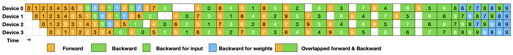

# DualPipe

DualPipe is an innovative bidirectional pipeline parallelism algorithm introduced in the [DeepSeek-V3 Technical Report](https://arxiv.org/pdf/2412.19437). It achieves full overlap of forward and backward computation-communication phases, also reducing pipeline bubbles. For detailed information on computation-communication overlap, please refer to the [profile data](https://github.com/deepseek-ai/profile-data).

### Schedules


Example DualPipe scheduling for 8 PP ranks and 20 micro-batches in two directions.
The micro-batches in the reverse direction are symmetric to those in the forward direction, so
we omit their batch ID for illustration simplicity. Two cells enclosed by a shared black border
have mutually overlapped computation and communication

## DualPipeV

DualPipeV is a concise V-shape schedule derived from DualPipe using a "cut-in-half" procedure, introduced by Sea AI Lab as "Cut-in-half" in their [blog post](https://hackmd.io/@ufotalent/r1lVXsa9Jg). Thanks to them for this efficient schedule!

### Schedules



Example DualPipeV scheduling for 4 PP ranks (8 PP stages) and 10 micro-batches.

## Pipeline Bubbles and Memory Usage Comparison (based on the same number of PP stages)

| Method      | Bubble                          | Parameter Per Device | Activation Per Device | #Devices |
|-------------|---------------------------------|----------------------|-----------------------|----------|
| 1F1B        | (*PP*-1)(𝐹+𝐵)                   | 1×                   | *PP*                  | *PP*     |
| ZB1P        | (*PP*-1)(𝐹+𝐵-2𝑊)               | 1×                   | *PP*                  | *PP*     |
| DualPipe    | (*PP*/2-1)(𝐹&𝐵+𝐵-3𝑊)           | 2×                   | *PP*+1                | *PP*     |
| DualPipeV   | (*PP*/2-1)(𝐹&𝐵+𝐵-3𝑊)           | 2×                   | *PP*+1                | *PP*/2   |

*PP* denotes the number of pp stages (even).
𝐹 denotes the execution time of a forward chunk, 𝐵 denotes the execution time of a
full backward chunk, 𝑊 denotes the execution time of a "backward for weights" chunk, and 𝐹&𝐵
denotes the execution time of two mutually overlapped forward and backward chunks.

## Quick Start

The usage is shown in the following example:

```bash
python examples/example_dualpipe.py
python examples/example_dualpipev.py
```

Note: For real-world applications, you will need to implement a custom `overlapped_forward_backward` method tailored to your specific module.

## Requirements

- PyTorch 2.0 and above

## Developers

DualPipe was created and developed by Jiashi Li and Chengqi Deng and Wenfeng Liang.

## Citation

```bibtex
@misc{deepseekai2025deepseekv3technicalreport,
      title={DeepSeek-V3 Technical Report}, 
      author={DeepSeek-AI},
      year={2025},
      eprint={2412.19437},
      archivePrefix={arXiv},
      primaryClass={cs.CL},
      url={https://arxiv.org/abs/2412.19437}, 
}
```
