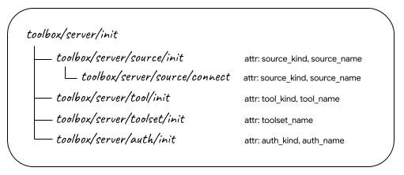
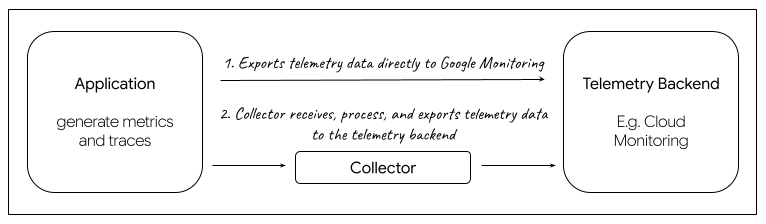

## About

Telemetry data such as logs, metrics, and traces will help developers understand
the internal state of the system. This page walks though different types of
telemetry and observability available in Toolbox.

Toolbox exports telemetry data of logs via standard out/err, and traces/metrics
through [OpenTelemetry](https://opentelemetry.io/). Additional flags can be
passed to Toolbox to enable different logging behavior, or to export metrics
through a specific [exporter](#exporter).

## Logging

The following flags can be used to customize Toolbox logging:

| **Flag**           | **Description**                                                                         |
|--------------------|-----------------------------------------------------------------------------------------|
| `--log-level`      | Preferred log level, allowed values: `debug`, `info`, `warn`, `error`. Default: `info`. |
| `--logging-format` | Preferred logging format, allowed values: `standard`, `json`. Default: `standard`.      |

**Example:**

```bash
./toolbox --tools-file "tools.yaml" --log-level warn --logging-format json
```

### Level

Toolbox supports the following log levels, including:

| **Log level** | **Description**                                                                                                                                                                    |
|---------------|------------------------------------------------------------------------------------------------------------------------------------------------------------------------------------|
| Debug         | Debug logs typically contain information that is only useful during the debugging phase and may be of little value during production.                                              |
| Info          | Info logs include information about successful operations within the application, such as a successful start, pause, or exit of the application.                                   |
| Warn          | Warning logs are slightly less severe than error conditions. While it does not cause an error, it indicates that an operation might fail in the future if action is not taken now. |
| Error         | Error log is assigned to event logs that contain an application error message.                                                                                                     |

Toolbox will only output logs that are equal or more severe to the
level that it is set. Below are the log levels that Toolbox supports in the
order of severity.

### Format

Toolbox supports both standard and structured logging format.

The standard logging outputs log as string:

```
2024-11-12T15:08:11.451377-08:00 INFO "Initialized 0 sources.\n"
```

The structured logging outputs log as JSON:

```
{
  "timestamp":"2024-11-04T16:45:11.987299-08:00",
  "severity":"ERROR",
  "logging.googleapis.com/sourceLocation":{...},
  "message":"unable to parse tool file at \"tools.yaml\": \"cloud-sql-postgres1\" is not a valid type of data source"
}
```


`logging.googleapis.com/sourceLocation` shows the source code
location information associated with the log entry, if any.


## Telemetry

Toolbox is supports exporting metrics and traces to any OpenTelemetry compatible
exporter.

### Metrics

A metric is a measurement of a service captured at runtime. The collected data
can be used to provide important insights into the service. Toolbox provides the
following custom metrics:

| **Metric Name**                    | **Description**                                         |
|------------------------------------|---------------------------------------------------------|
| `toolbox.server.toolset.get.count` | Counts the number of toolset manifest requests served   |
| `toolbox.server.tool.get.count`    | Counts the number of tool manifest requests served      |
| `toolbox.server.tool.get.invoke`   | Counts the number of tool invocation requests served    |
| `toolbox.server.mcp.sse.count`     | Counts the number of mcp sse connection requests served |
| `toolbox.server.mcp.post.count`    | Counts the number of mcp post requests served           |

All custom metrics have the following attributes/labels:

| **Metric Attributes**      | **Description**                                           |
|----------------------------|-----------------------------------------------------------|
| `toolbox.name`             | Name of the toolset or tool, if applicable.               |
| `toolbox.operation.status` | Operation status code, for example: `success`, `failure`. |
| `toolbox.sse.sessionId`    | Session id for sse connection, if applicable.             |
| `toolbox.method`           | Method of JSON-RPC request, if applicable.                |

### Traces

A trace is a tree of spans that shows the path that a request makes through an
application.

Spans generated by Toolbox server is prefixed with `toolbox/server/`. For
example, when user run Toolbox, it will generate spans for the following, with
`toolbox/server/init` as the root span:



### Resource Attributes

All metrics and traces generated within Toolbox will be associated with a
unified [resource][resource]. The list of resource attributes included are:

| **Resource Name**                                                                         | **Description**                                                                                                                                               |
|-------------------------------------------------------------------------------------------|---------------------------------------------------------------------------------------------------------------------------------------------------------------|
| [TelemetrySDK](https://pkg.go.dev/go.opentelemetry.io/otel/sdk/resource#WithTelemetrySDK) | TelemetrySDK version info.                                                                                                                                    |
| [OS](https://pkg.go.dev/go.opentelemetry.io/otel/sdk/resource#WithOS)                     | OS attributes including OS description and OS type.                                                                                                           |
| [Container](https://pkg.go.dev/go.opentelemetry.io/otel/sdk/resource#WithContainer)       | Container attributes including container ID, if applicable.                                                                                                   |
| [Host](https://pkg.go.dev/go.opentelemetry.io/otel/sdk/resource#WithHost)                 | Host attributes including host name.                                                                                                                          |
| [SchemaURL](https://pkg.go.dev/go.opentelemetry.io/otel/sdk/resource#WithSchemaURL)       | Sets the schema URL for the configured resource.                                                                                                              |
| `service.name`                                                                            | Open telemetry service name. Defaulted to `toolbox`. User can set the service name via flag mentioned above to distinguish between different toolbox service. |
| `service.version`                                                                         | The version of Toolbox used.                                                                                                                                  |

[resource]: https://opentelemetry.io/docs/languages/go/resources/

### Exporter

An exporter is responsible for processing and exporting telemetry data. Toolbox
generates telemetry data within the OpenTelemetry Protocol (OTLP), and user can
choose to use exporters that are designed to support the OpenTelemetry
Protocol. Within Toolbox, we provide two types of exporter implementation to
choose from, either the Google Cloud Exporter that will send data directly to
the backend, or the OTLP Exporter along with a Collector that will act as a
proxy to collect and export data to the telemetry backend of user's choice.



#### Google Cloud Exporter

The Google Cloud Exporter directly exports telemetry to Google Cloud Monitoring.
It utilizes the [GCP Metric Exporter][gcp-metric-exporter] and [GCP Trace
Exporter][gcp-trace-exporter].

[gcp-metric-exporter]:
    https://github.com/GoogleCloudPlatform/opentelemetry-operations-go/tree/main/exporter/metric
[gcp-trace-exporter]:
    https://github.com/GoogleCloudPlatform/opentelemetry-operations-go/tree/main/exporter/trace


If you're using Google Cloud Monitoring, the following APIs will need to be
enabled:

- [Cloud Logging API](https://cloud.google.com/logging/docs/api/enable-api)
- [Cloud Monitoring API](https://cloud.google.com/monitoring/api/enable-api)
- [Cloud Trace API](https://console.cloud.google.com/apis/enableflow?apiid=cloudtrace.googleapis.com)


#### OTLP Exporter

This implementation uses the default OTLP Exporter over HTTP for
[metrics][otlp-metric-exporter] and [traces][otlp-trace-exporter]. You can use
this exporter if you choose to export your telemetry data to a Collector.

[otlp-metric-exporter]: https://opentelemetry.io/docs/languages/go/exporters/#otlp-traces-over-http
[otlp-trace-exporter]: https://opentelemetry.io/docs/languages/go/exporters/#otlp-traces-over-http

### Collector

A collector acts as a proxy between the application and the telemetry backend.
It receives telemetry data, transforms it, and then exports data to backends
that can store it permanently. Toolbox provide an option to export telemetry
data to user's choice of backend(s) that are compatible with the Open Telemetry
Protocol (OTLP). If you would like to use a collector, please refer to this
[Export Telemetry using the Otel Collector](../../how-to/export_telemetry.md).

### Flags

The following flags are used to determine Toolbox's telemetry configuration:

| **flag**                   | **type** | **description**                                                                                                                                                                                           |
|----------------------------|----------|-----------------------------------------------------------------------------------------------------------------------------------------------------------------------------------------------------------|
| `--telemetry-gcp`          | bool     | Enable exporting directly to Google Cloud Monitoring. Default is `false`.                                                                                                                                 |
| `--telemetry-otlp`         | string   | Enable exporting using OpenTelemetry Protocol (OTLP) to the specified endpoint (e.g. "127.0.0.1:4318"). To pass an insecure endpoint here, set environment variable `OTEL_EXPORTER_OTLP_INSECURE=true`. |
| `--telemetry-service-name` | string   | Sets the value of the `service.name` resource attribute. Default is `toolbox`.                                                                                                                            |

In addition to the flags noted above, you can also make additional configuration
for OpenTelemetry via the [General SDK Configuration][sdk-configuration] through
environmental variables.

[sdk-configuration]:
    https://opentelemetry.io/docs/languages/sdk-configuration/general/

**Examples:**

To enable Google Cloud Exporter:

```bash
./toolbox --telemetry-gcp
```

To enable OTLP Exporter, provide Collector endpoint:

```bash
./toolbox --telemetry-otlp="127.0.0.1:4553"
```
