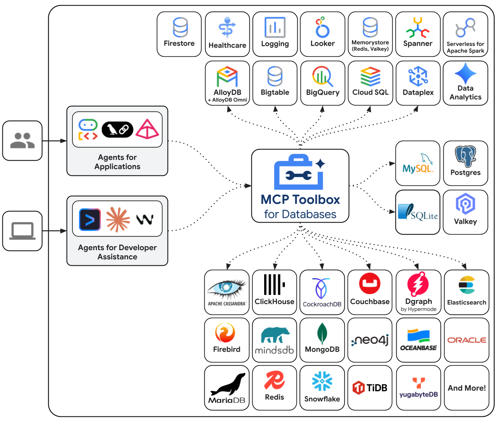

MCP Toolbox for Databases is an open source MCP server for databases. It enables
you to develop tools easier, faster, and more securely by handling the complexities
such as connection pooling, authentication, and more.


This solution was originally named “Gen AI Toolbox for
Databases” as its initial development predated MCP, but was renamed to align
with recently added MCP compatibility.



This document has been updated to support the configuration file v2 format. To
view documentation with configuration file v1 format, please navigate to the
top-right menu and select versions v0.26.0 or older.


## Why Toolbox?

Toolbox helps you build Gen AI tools that let your agents access data in your
database. Toolbox provides:

- **Simplified development**: Integrate tools to your agent in less than 10
  lines of code, reuse tools between multiple agents or frameworks, and deploy
  new versions of tools more easily.
- **Better performance**: Best practices such as connection pooling,
  authentication, and more.
- **Enhanced security**: Integrated auth for more secure access to your data
- **End-to-end observability**: Out of the box metrics and tracing with built-in
  support for OpenTelemetry.

**⚡ Supercharge Your Workflow with an AI Database Assistant ⚡**

Stop context-switching and let your AI assistant become a true co-developer. By
[connecting your IDE to your databases with MCP Toolbox][connect-ide], you can
delegate complex and time-consuming database tasks, allowing you to build faster
and focus on what matters. This isn't just about code completion; it's about
giving your AI the context it needs to handle the entire development lifecycle.

Here’s how it will save you time:

- **Query in Plain English**: Interact with your data using natural language
  right from your IDE. Ask complex questions like, *"How many orders were
  delivered in 2024, and what items were in them?"* without writing any SQL.
- **Automate Database Management**: Simply describe your data needs, and let the
  AI assistant manage your database for you. It can handle generating queries,
  creating tables, adding indexes, and more.
- **Generate Context-Aware Code**: Empower your AI assistant to generate
  application code and tests with a deep understanding of your real-time
  database schema.  This accelerates the development cycle by ensuring the
  generated code is directly usable.
- **Slash Development Overhead**: Radically reduce the time spent on manual
  setup and boilerplate. MCP Toolbox helps streamline lengthy database
  configurations, repetitive code, and error-prone schema migrations.

Learn [how to connect your AI tools (IDEs) to Toolbox using MCP][connect-ide].

[connect-ide]: ../../how-to/connect-ide/

## General Architecture

Toolbox sits between your application's orchestration framework and your
database, providing a control plane that is used to modify, distribute, or
invoke tools. It simplifies the management of your tools by providing you with a
centralized location to store and update tools, allowing you to share tools
between agents and applications and update those tools without necessarily
redeploying your application.



## Getting Started

### Quickstart: Running Toolbox using NPX 

You can run Toolbox directly with a [configuration file](../configure.md):

```sh
npx @toolbox-sdk/server --tools-file tools.yaml
```

This runs the latest version of the toolbox server with your configuration file.


This method should only be used for non-production use cases such as
experimentation. For any production use-cases, please consider [Installing the
server](#installing-the-server) and then [running it](#running-the-server).


### Installing the server

For the latest version, check the [releases page][releases] and use the
following instructions for your OS and CPU architecture.

[releases]: https://github.com/googleapis/genai-toolbox/releases

<!-- {x-release-please-start-version} -->

{}

{}
To install Toolbox as a binary on Linux (AMD64):

```sh
# see releases page for other versions
export VERSION=0.27.0
curl -L -o toolbox https://storage.googleapis.com/genai-toolbox/v$VERSION/linux/amd64/toolbox
chmod +x toolbox
```

{}
{}
To install Toolbox as a binary on macOS (Apple Silicon):

```sh
# see releases page for other versions
export VERSION=0.27.0
curl -L -o toolbox https://storage.googleapis.com/genai-toolbox/v$VERSION/darwin/arm64/toolbox
chmod +x toolbox
```

{}
{}
To install Toolbox as a binary on macOS (Intel):

```sh
# see releases page for other versions
export VERSION=0.27.0
curl -L -o toolbox https://storage.googleapis.com/genai-toolbox/v$VERSION/darwin/amd64/toolbox
chmod +x toolbox
```

{}
{}
To install Toolbox as a binary on Windows (Command Prompt):

```cmd
:: see releases page for other versions
set VERSION=0.27.0
curl -o toolbox.exe "https://storage.googleapis.com/genai-toolbox/v%VERSION%/windows/amd64/toolbox.exe"
```

{}
{}
To install Toolbox as a binary on Windows (PowerShell):

```powershell
# see releases page for other versions
$VERSION = "0.27.0"
curl.exe -o toolbox.exe "https://storage.googleapis.com/genai-toolbox/v$VERSION/windows/amd64/toolbox.exe"
```

{}

{}
{}
You can also install Toolbox as a container:

```sh
# see releases page for other versions
export VERSION=0.27.0
docker pull us-central1-docker.pkg.dev/database-toolbox/toolbox/toolbox:$VERSION
```

{}
{}
To install Toolbox using Homebrew on macOS or Linux:

```sh
brew install mcp-toolbox
```

{}
{}

To install from source, ensure you have the latest version of
[Go installed](https://go.dev/doc/install), and then run the following command:

```sh
go install github.com/googleapis/genai-toolbox@v0.27.0
```

{}

<!-- {x-release-please-end} -->

### Running the server

[Configure](../configure.md) a `tools.yaml` to define your tools, and then
execute `toolbox` to start the server:

```sh
./toolbox --tools-file "tools.yaml"
```


Toolbox enables dynamic reloading by default. To disable, use the
`--disable-reload` flag.


#### Launching Toolbox UI

To launch Toolbox's interactive UI, use the `--ui` flag. This allows you to test
tools and toolsets with features such as authorized parameters. To learn more,
visit [Toolbox UI](../../how-to/toolbox-ui/index.md).

```sh
./toolbox --ui
```

#### Homebrew Users

If you installed Toolbox using Homebrew, the `toolbox` binary is available in
your system path. You can start the server with the same command:

```sh
toolbox --tools-file "tools.yaml"
```

You can use `toolbox help` for a full list of flags! To stop the server, send a
terminate signal (`ctrl+c` on most platforms).

For more detailed documentation on deploying to different environments, check
out the resources in the [How-to section](../../how-to/)

### Integrating your application

Once your server is up and running, you can load the tools into your
application. See below the list of Client SDKs for using various frameworks:

#### Python


{}

Once you've installed the [Toolbox Core
SDK](https://pypi.org/project/toolbox-core/), you can load
tools:


from toolbox_core import ToolboxClient

# update the url to point to your server

async with ToolboxClient("http://127.0.0.1:5000") as client:

    # these tools can be passed to your application!
    tools = await client.load_toolset("toolset_name")


For more detailed instructions on using the Toolbox Core SDK, see the
[project's
README](https://github.com/googleapis/mcp-toolbox-sdk-python/blob/main/packages/toolbox-core/README.md).

{}
{}

Once you've installed the [Toolbox LangChain
SDK](https://pypi.org/project/toolbox-langchain/), you can load
tools:


from toolbox_langchain import ToolboxClient

# update the url to point to your server

async with ToolboxClient("http://127.0.0.1:5000") as client:

    # these tools can be passed to your application!
    tools = client.load_toolset()


For more detailed instructions on using the Toolbox LangChain SDK, see the
[project's
README](https://github.com/googleapis/mcp-toolbox-sdk-python/blob/main/packages/toolbox-langchain/README.md).

{}
{}

Once you've installed the [Toolbox Llamaindex
SDK](https://github.com/googleapis/genai-toolbox-llamaindex-python), you can load
tools:


from toolbox_llamaindex import ToolboxClient

# update the url to point to your server

async with ToolboxClient("http://127.0.0.1:5000") as client:

# these tools can be passed to your application

  tools = client.load_toolset()


For more detailed instructions on using the Toolbox Llamaindex SDK, see the
[project's
README](https://github.com/googleapis/genai-toolbox-llamaindex-python/blob/main/README.md).

{}


#### Javascript/Typescript

Once you've installed the [Toolbox Core
SDK](https://www.npmjs.com/package/@toolbox-sdk/core), you can load
tools:


{}


import { ToolboxClient } from '@toolbox-sdk/core';

// update the url to point to your server
const URL = 'http://127.0.0.1:5000';
let client = new ToolboxClient(URL);

// these tools can be passed to your application!
const toolboxTools = await client.loadToolset('toolsetName');


For more detailed instructions on using the Toolbox Core SDK, see the
[project's
README](https://github.com/googleapis/mcp-toolbox-sdk-js/blob/main/packages/toolbox-core/README.md).

{}
{}


import { ToolboxClient } from '@toolbox-sdk/core';

// update the url to point to your server
const URL = 'http://127.0.0.1:5000';
let client = new ToolboxClient(URL);

// these tools can be passed to your application!
const toolboxTools = await client.loadToolset('toolsetName');

// Define the basics of the tool: name, description, schema and core logic
const getTool = (toolboxTool) => tool(currTool, {
    name: toolboxTool.getName(),
    description: toolboxTool.getDescription(),
    schema: toolboxTool.getParamSchema()
});

// Use these tools in your Langchain/Langraph applications
const tools = toolboxTools.map(getTool);


For more detailed instructions on using the Toolbox Core SDK, see the
[project's
README](https://github.com/googleapis/mcp-toolbox-sdk-js/blob/main/packages/toolbox-core/README.md).

{}
{}


import { ToolboxClient } from '@toolbox-sdk/core';
import { genkit } from 'genkit';

// Initialise genkit
const ai = genkit({
    plugins: [
        googleAI({
            apiKey: process.env.GEMINI_API_KEY || process.env.GOOGLE_API_KEY
        })
    ],
    model: googleAI.model('gemini-2.0-flash'),
});

// update the url to point to your server
const URL = 'http://127.0.0.1:5000';
let client = new ToolboxClient(URL);

// these tools can be passed to your application!
const toolboxTools = await client.loadToolset('toolsetName');

// Define the basics of the tool: name, description, schema and core logic
const getTool = (toolboxTool) => ai.defineTool({
    name: toolboxTool.getName(),
    description: toolboxTool.getDescription(),
    schema: toolboxTool.getParamSchema()
}, toolboxTool)

// Use these tools in your Genkit applications
const tools = toolboxTools.map(getTool);


For more detailed instructions on using the Toolbox Core SDK, see the
[project's
README](https://github.com/googleapis/mcp-toolbox-sdk-js/blob/main/packages/toolbox-core/README.md).

{}
{}


import { ToolboxClient } from '@toolbox-sdk/core';
import { tool } from "llamaindex";

// update the url to point to your server
const URL = 'http://127.0.0.1:5000';
let client = new ToolboxClient(URL);

// these tools can be passed to your application!
const toolboxTools = await client.loadToolset('toolsetName');

// Define the basics of the tool: name, description, schema and core logic
const getTool = (toolboxTool) => tool({
    name: toolboxTool.getName(),
    description: toolboxTool.getDescription(),
    parameters: toolboxTool.getParamSchema(),
    execute: toolboxTool
});;

// Use these tools in your LlamaIndex applications
const tools = toolboxTools.map(getTool);



For more detailed instructions on using the Toolbox Core SDK, see the
[project's
README](https://github.com/googleapis/mcp-toolbox-sdk-js/blob/main/packages/toolbox-core/README.md).

{}
{}


import { ToolboxClient } from '@toolbox-sdk/adk';

// Replace with the actual URL where your Toolbox service is running
const URL = 'http://127.0.0.1:5000';

let client = new ToolboxClient(URL);
const tools = await client.loadToolset();

// Use the client and tools as per requirement



For detailed samples on using the Toolbox JS SDK with ADK JS, see the [project's
README.](https://github.com/googleapis/mcp-toolbox-sdk-js/tree/main/packages/toolbox-adk/README.md)

{}



#### Go

Once you've installed the [Toolbox Go
SDK](https://pkg.go.dev/github.com/googleapis/mcp-toolbox-sdk-go/core), you can load
tools:


{}


package main

import (
	"context"
	"log"

	"github.com/googleapis/mcp-toolbox-sdk-go/core"
)

func main() {
	// update the url to point to your server
	URL := "http://127.0.0.1:5000"
	ctx := context.Background()

	client, err := core.NewToolboxClient(URL)
	if err != nil {
		log.Fatalf("Failed to create Toolbox client: %v", err)
	}

	// Framework agnostic tools
	tools, err := client.LoadToolset("toolsetName", ctx)
	if err != nil {
		log.Fatalf("Failed to load tools: %v", err)
	}
}


{}
{}


package main

import (
	"context"
	"encoding/json"
	"log"

	"github.com/googleapis/mcp-toolbox-sdk-go/core"
	"github.com/tmc/langchaingo/llms"
)

func main() {
	// Make sure to add the error checks
	// update the url to point to your server
	URL := "http://127.0.0.1:5000"
	ctx := context.Background()

	client, err := core.NewToolboxClient(URL)
	if err != nil {
		log.Fatalf("Failed to create Toolbox client: %v", err)
	}

	// Framework agnostic tool
	tool, err := client.LoadTool("toolName", ctx)
	if err != nil {
		log.Fatalf("Failed to load tools: %v", err)
	}

	// Fetch the tool's input schema
	inputschema, err := tool.InputSchema()
	if err != nil {
		log.Fatalf("Failed to fetch inputSchema: %v", err)
	}

	var paramsSchema map[string]any
	_ = json.Unmarshal(inputschema, &paramsSchema)

	// Use this tool with LangChainGo
	langChainTool := llms.Tool{
		Type: "function",
		Function: &llms.FunctionDefinition{
			Name:        tool.Name(),
			Description: tool.Description(),
			Parameters:  paramsSchema,
		},
	}
}

For end-to-end samples on using the Toolbox Go SDK with LangChain Go, see the [project's
samples](https://github.com/googleapis/mcp-toolbox-sdk-go/tree/main/core/samples)

{}
{}


package main
import (
	"context"
	"encoding/json"
	"log"

	"github.com/firebase/genkit/go/ai"
	"github.com/firebase/genkit/go/genkit"
	"github.com/googleapis/mcp-toolbox-sdk-go/core"
	"github.com/googleapis/mcp-toolbox-sdk-go/tbgenkit"
	"github.com/invopop/jsonschema"
)

func main() {
	// Make sure to add the error checks
	// Update the url to point to your server
	URL := "http://127.0.0.1:5000"
	ctx := context.Background()
	g, err := genkit.Init(ctx)

	client, err := core.NewToolboxClient(URL)
	if err != nil {
		log.Fatalf("Failed to create Toolbox client: %v", err)
	}

	// Framework agnostic tool
	tool, err := client.LoadTool("toolName", ctx)
	if err != nil {
		log.Fatalf("Failed to load tools: %v", err)
	}

	// Convert the tool using the tbgenkit package
 	// Use this tool with Genkit Go
	genkitTool, err := tbgenkit.ToGenkitTool(tool, g)
	if err != nil {
		log.Fatalf("Failed to convert tool: %v\n", err)
	}
}

For end-to-end samples on using the Toolbox Go SDK with Genkit Go, see the [project's
samples](https://github.com/googleapis/mcp-toolbox-sdk-go/tree/main/tbgenkit/samples)

{}
{}


package main

import (
	"context"
	"encoding/json"
	"log"

	"github.com/googleapis/mcp-toolbox-sdk-go/core"
	"google.golang.org/genai"
)

func main() {
	// Make sure to add the error checks
	// Update the url to point to your server
	URL := "http://127.0.0.1:5000"
	ctx := context.Background()

	client, err := core.NewToolboxClient(URL)
	if err != nil {
		log.Fatalf("Failed to create Toolbox client: %v", err)
	}

	// Framework agnostic tool
	tool, err := client.LoadTool("toolName", ctx)
	if err != nil {
		log.Fatalf("Failed to load tools: %v", err)
	}

	// Fetch the tool's input schema
	inputschema, err := tool.InputSchema()
	if err != nil {
		log.Fatalf("Failed to fetch inputSchema: %v", err)
	}

	var schema *genai.Schema
	_ = json.Unmarshal(inputschema, &schema)

	funcDeclaration := &genai.FunctionDeclaration{
		Name:        tool.Name(),
		Description: tool.Description(),
		Parameters:  schema,
	}

	// Use this tool with Go GenAI
	genAITool := &genai.Tool{
		FunctionDeclarations: []*genai.FunctionDeclaration{funcDeclaration},
	}
}

For end-to-end samples on using the Toolbox Go SDK with Go GenAI, see the [project's
samples](https://github.com/googleapis/mcp-toolbox-sdk-go/tree/main/core/samples)

{}

{}


package main

import (
	"context"
	"encoding/json"
	"log"

	"github.com/googleapis/mcp-toolbox-sdk-go/core"
	openai "github.com/openai/openai-go"
)

func main() {
	// Make sure to add the error checks
	// Update the url to point to your server
	URL := "http://127.0.0.1:5000"
	ctx := context.Background()

	client, err := core.NewToolboxClient(URL)
	if err != nil {
		log.Fatalf("Failed to create Toolbox client: %v", err)
	}

	// Framework agnostic tool
	tool, err := client.LoadTool("toolName", ctx)
	if err != nil {
		log.Fatalf("Failed to load tools: %v", err)
	}

	// Fetch the tool's input schema
	inputschema, err := tool.InputSchema()
	if err != nil {
		log.Fatalf("Failed to fetch inputSchema: %v", err)
	}

	var paramsSchema openai.FunctionParameters
	_ = json.Unmarshal(inputschema, &paramsSchema)

	// Use this tool with OpenAI Go
	openAITool := openai.ChatCompletionToolParam{
		Function: openai.FunctionDefinitionParam{
			Name:        tool.Name(),
			Description: openai.String(tool.Description()),
			Parameters:  paramsSchema,
		},
	}
}

For end-to-end samples on using the Toolbox Go SDK with OpenAI Go, see the [project's
samples](https://github.com/googleapis/mcp-toolbox-sdk-go/tree/main/core/samples)

{}

{}


package main

import (
  	"context"
  	"fmt"
  	"github.com/googleapis/mcp-toolbox-sdk-go/tbadk"
)

func main() {
  	// Make sure to add the error checks
	// Update the url to point to your server
	URL := "http://127.0.0.1:5000"
	ctx := context.Background()
  	client, err := tbadk.NewToolboxClient(URL)
  	if err != nil {
		return fmt.Sprintln("Could not start Toolbox Client", err)
  	}

  	// Use this tool with ADK Go
  	tool, err := client.LoadTool("toolName", ctx)
  	if err != nil {
		return fmt.Sprintln("Could not load Toolbox Tool", err)
  	}
}



For end-to-end samples on using the Toolbox Go SDK with ADK Go, see the [project's
samples](https://github.com/googleapis/mcp-toolbox-sdk-go/tree/main/tbadk/samples)

{}


For more detailed instructions on using the Toolbox Go SDK, see the
[project's
README](https://github.com/googleapis/mcp-toolbox-sdk-go/blob/main/core/README.md).
