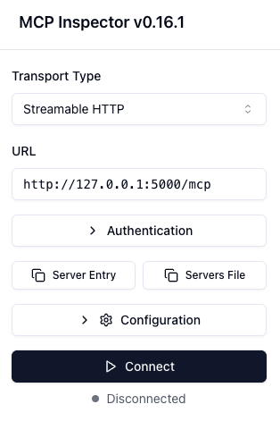

## Overview

[Model Context Protocol](https://modelcontextprotocol.io) is an open protocol
that standardizes how applications provide context to LLMs. Check out this page
on how to [connect to Toolbox via MCP](../../how-to/connect_via_mcp.md).

## Step 1: Set up your database

In this section, we will create a database, insert some data that needs to be
access by our agent, and create a database user for Toolbox to connect with.

1. Connect to postgres using the `psql` command:

    ```bash
    psql -h 127.0.0.1 -U postgres
    ```

    Here, `postgres` denotes the default postgres superuser.

1. Create a new database and a new user:

    
  For a real application, it's best to follow the principle of least permission
  and only grant the privileges your application needs.
    

    ```sql
      CREATE USER toolbox_user WITH PASSWORD 'my-password';

      CREATE DATABASE toolbox_db;
      GRANT ALL PRIVILEGES ON DATABASE toolbox_db TO toolbox_user;

      ALTER DATABASE toolbox_db OWNER TO toolbox_user;
    ```

1. End the database session:

    ```bash
    \q
    ```

1. Connect to your database with your new user:

    ```bash
    psql -h 127.0.0.1 -U toolbox_user -d toolbox_db
    ```

1. Create a table using the following command:

    ```sql
    CREATE TABLE hotels(
      id            INTEGER NOT NULL PRIMARY KEY,
      name          VARCHAR NOT NULL,
      location      VARCHAR NOT NULL,
      price_tier    VARCHAR NOT NULL,
      checkin_date  DATE    NOT NULL,
      checkout_date DATE    NOT NULL,
      booked        BIT     NOT NULL
    );
    ```

1. Insert data into the table.

    ```sql
    INSERT INTO hotels(id, name, location, price_tier, checkin_date, checkout_date, booked)
    VALUES
      (1, 'Hilton Basel', 'Basel', 'Luxury', '2024-04-22', '2024-04-20', B'0'),
      (2, 'Marriott Zurich', 'Zurich', 'Upscale', '2024-04-14', '2024-04-21', B'0'),
      (3, 'Hyatt Regency Basel', 'Basel', 'Upper Upscale', '2024-04-02', '2024-04-20', B'0'),
      (4, 'Radisson Blu Lucerne', 'Lucerne', 'Midscale', '2024-04-24', '2024-04-05', B'0'),
      (5, 'Best Western Bern', 'Bern', 'Upper Midscale', '2024-04-23', '2024-04-01', B'0'),
      (6, 'InterContinental Geneva', 'Geneva', 'Luxury', '2024-04-23', '2024-04-28', B'0'),
      (7, 'Sheraton Zurich', 'Zurich', 'Upper Upscale', '2024-04-27', '2024-04-02', B'0'),
      (8, 'Holiday Inn Basel', 'Basel', 'Upper Midscale', '2024-04-24', '2024-04-09', B'0'),
      (9, 'Courtyard Zurich', 'Zurich', 'Upscale', '2024-04-03', '2024-04-13', B'0'),
      (10, 'Comfort Inn Bern', 'Bern', 'Midscale', '2024-04-04', '2024-04-16', B'0');
    ```

1. End the database session:

    ```bash
    \q
    ```

## Step 2: Install and configure Toolbox

In this section, we will download Toolbox, configure our tools in a
`tools.yaml`, and then run the Toolbox server.

1. Download the latest version of Toolbox as a binary:

    
  Select the
  [correct binary](https://github.com/googleapis/genai-toolbox/releases)
  corresponding to your OS and CPU architecture.
    
    <!-- {x-release-please-start-version} -->
    ```bash
    export OS="linux/amd64" # one of linux/amd64, darwin/arm64, darwin/amd64, or windows/amd64
    curl -O https://storage.googleapis.com/genai-toolbox/v0.27.0/$OS/toolbox
    ```
    <!-- {x-release-please-end} -->

1. Make the binary executable:

    ```bash
    chmod +x toolbox
    ```

1. Write the following into a `tools.yaml` file. Be sure to update any fields
   such as `user`, `password`, or `database` that you may have customized in the
   previous step.

    
  In practice, use environment variable replacement with the format ${ENV_NAME}
  instead of hardcoding your secrets into the configuration file.
    

    ```yaml
    kind: sources
    name: my-pg-source
    type: postgres
    host: 127.0.0.1
    port: 5432
    database: toolbox_db
    user: toolbox_user
    password: my-password
    ---
    kind: tools
    name: search-hotels-by-name
    type: postgres-sql
    source: my-pg-source
    description: Search for hotels based on name.
    parameters:
      - name: name
        type: string
        description: The name of the hotel.
    statement: SELECT * FROM hotels WHERE name ILIKE '%' || $1 || '%';
    ---
    kind: tools
    name: search-hotels-by-location
    type: postgres-sql
    source: my-pg-source
    description: Search for hotels based on location.
    parameters:
      - name: location
        type: string
        description: The location of the hotel.
    statement: SELECT * FROM hotels WHERE location ILIKE '%' || $1 || '%';
    ---
    kind: tools
    name: book-hotel
    type: postgres-sql
    source: my-pg-source
    description: >-
       Book a hotel by its ID. If the hotel is successfully booked, returns a NULL, raises an error if not.
    parameters:
      - name: hotel_id
        type: string
        description: The ID of the hotel to book.
    statement: UPDATE hotels SET booked = B'1' WHERE id = $1;
    ---
    kind: tools
    name: update-hotel
    type: postgres-sql
    source: my-pg-source
    description: >-
      Update a hotel's check-in and check-out dates by its ID. Returns a message
      indicating  whether the hotel was successfully updated or not.
    parameters:
      - name: hotel_id
        type: string
        description: The ID of the hotel to update.
      - name: checkin_date
        type: string
        description: The new check-in date of the hotel.
      - name: checkout_date
        type: string
        description: The new check-out date of the hotel.
    statement: >-
      UPDATE hotels SET checkin_date = CAST($2 as date), checkout_date = CAST($3
      as date) WHERE id = $1;
    ---
    kind: tools
    name: cancel-hotel
    type: postgres-sql
    source: my-pg-source
    description: Cancel a hotel by its ID.
    parameters:
      - name: hotel_id
        type: string
        description: The ID of the hotel to cancel.
    statement: UPDATE hotels SET booked = B'0' WHERE id = $1;
    ---
    kind: toolsets
    name: my-toolset
    tools:
      - search-hotels-by-name
      - search-hotels-by-location
      - book-hotel
      - update-hotel
      - cancel-hotel
    ```

    For more info on tools, check out the
    [Tools](../../resources/tools/) section.

1. Run the Toolbox server, pointing to the `tools.yaml` file created earlier:

    ```bash
    ./toolbox --tools-file "tools.yaml"
    ```

## Step 3: Connect to MCP Inspector

1. Run the MCP Inspector:

    ```bash
    npx @modelcontextprotocol/inspector
    ```

1. Type `y` when it asks to install the inspector package.

1. It should show the following when the MCP Inspector is up and running (please
   take note of `<YOUR_SESSION_TOKEN>`):

    ```bash
    Starting MCP inspector...
    ⚙️ Proxy server listening on localhost:6277
    🔑 Session token: <YOUR_SESSION_TOKEN>
       Use this token to authenticate requests or set DANGEROUSLY_OMIT_AUTH=true to disable auth

    🚀 MCP Inspector is up and running at:
       http://localhost:6274/?MCP_PROXY_AUTH_TOKEN=<YOUR_SESSION_TOKEN>
    ```

1. Open the above link in your browser.

1. For `Transport Type`, select `Streamable HTTP`.

1. For `URL`, type in `http://127.0.0.1:5000/mcp`.

1. For `Configuration` -> `Proxy Session Token`, make sure
   `<YOUR_SESSION_TOKEN>` is present.

1. Click Connect.

    

1. Select `List Tools`, you will see a list of tools configured in `tools.yaml`.

    

1. Test out your tools here!
