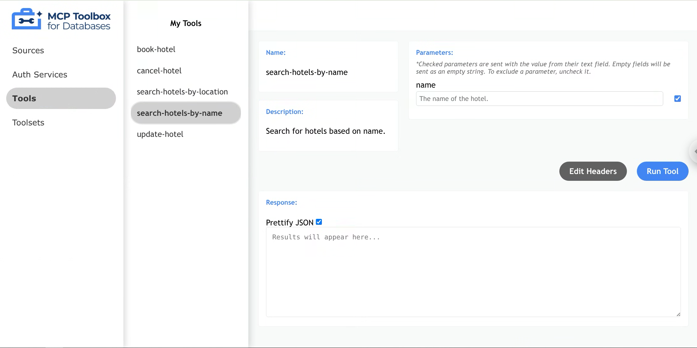
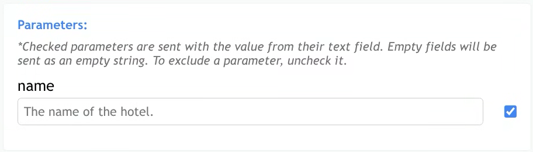
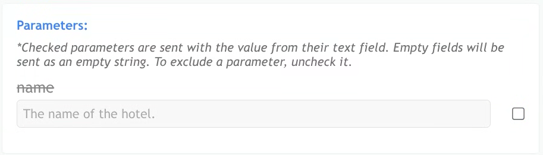
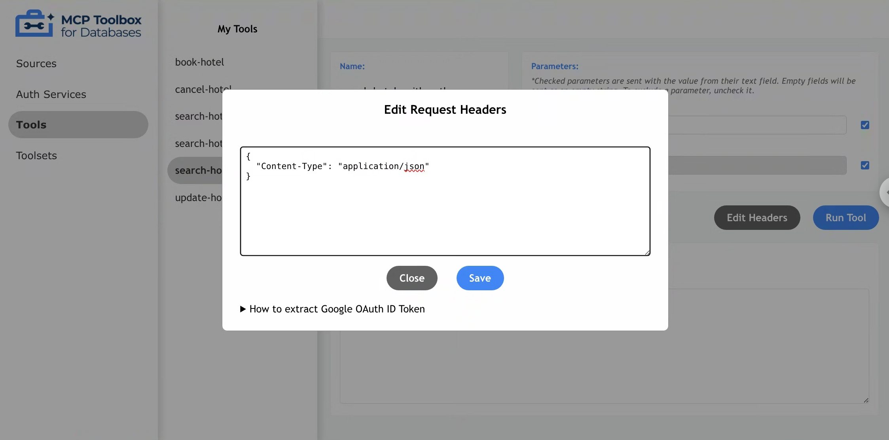
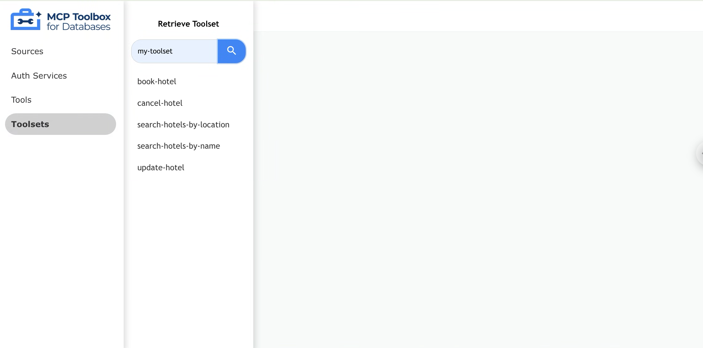

Toolbox UI is a built-in web interface that allows users to visually inspect and
test out configured resources such as tools and toolsets.

## Launching Toolbox UI

To launch Toolbox's interactive UI, use the `--ui` flag.

```sh
./toolbox --ui
```

Toolbox UI will be served from the same host and port as the Toolbox Server,
with the `/ui` suffix. Once Toolbox is launched, the following INFO log with
Toolbox UI's url will be shown:

```bash
INFO "Toolbox UI is up and running at: http://localhost:5000/ui"
```

## Navigating the Tools Page

The tools page shows all tools loaded from your configuration file. This
corresponds to the default toolset (represented by an empty string). Each tool's
name on this page will exactly match its name in the configuration file.

To view details for a specific tool, click on the tool name. The main content
area will be populated with the tool name, description, and available
parameters.



### Invoking a Tool

1. Click on a Tool
1. Enter appropriate parameters in each parameter field
1. Click "Run Tool"
1. Done! Your results will appear in the response field
1. (Optional) Uncheck "Prettify JSON" to format the response as plain text


### Optional Parameters

Toolbox allows users to add [optional
parameters](../../resources/tools/#basic-parameters) with or without a default
value.

To exclude a parameter, uncheck the box to the right of an associated parameter,
and that parameter will not be included in the request body. If the parameter is
not sent, Toolbox will either use it as `nil` value or the `default` value, if
configured. If the parameter is required, Toolbox will throw an error.

When the box is checked, parameter will be sent exactly as entered in the
response field (e.g. empty string).





### Editing Headers

To edit headers, press the "Edit Headers" button to display the header modal.
Within this modal, users can make direct edits by typing into the header's text
area.

Toolbox UI validates that the headers are in correct JSON format. Other
header-related errors (e.g., incorrect header names or values required by the
tool) will be reported in the Response section after running the tool.



#### Google OAuth

Currently, Toolbox supports Google OAuth 2.0 as an AuthService, which allows
tools to utilize authorized parameters. When a tool uses an authorized
parameter, the parameter will be displayed but not editable, as it will be
populated from the authentication token.

To provide the token, add your Google OAuth ID Token to the request header using
the "Edit Headers" button and modal described above. The key should be the name
of your AuthService as defined in your tool configuration file, suffixed with
`_token`. The value should be your ID token as a string.

1. Select a tool that requires [authenticated parameters]()
1. The auth parameter's text field is greyed out. This is because it cannot be
   entered manually and will be parsed from the resolved auth token
1. To update request headers with the token, select "Edit Headers"
1. (Optional) If you wish to manually edit the header, checkout the dropdown
   "How to extract Google OAuth ID Token manually" for guidance on retrieving ID
   token
1. To edit the header automatically, click the "Auto Setup" button that is
   associated with your Auth Profile
1. Enter the Client ID defined in your tools configuration file
1. Click "Continue"
1. Click "Sign in With Google" and login with your associated google account.
   This should automatically populate the header text area with your token
1. Click "Save"
1. Click "Run Tool"

```json
{
  "Content-Type": "application/json",
  "my-google-auth_token": "YOUR_ID_TOKEN_HERE"
}
```


## Navigating the Toolsets Page

Through the toolsets page, users can search for a specific toolset to retrieve
tools from. Simply enter the toolset name in the search bar, and press "Enter"
to retrieve the associated tools.

If the toolset name is not defined within the tools configuration file, an error
message will be displayed.


