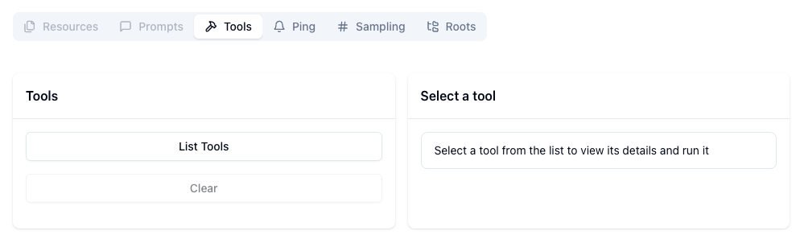

## Overview

[Model Context Protocol](https://modelcontextprotocol.io) is an open protocol
that standardizes how applications provide context to LLMs. Check out this page
on how to [connect to Toolbox via MCP](../../../how-to/connect_via_mcp.md).

## Step 1: Set up your BigQuery Dataset and Table

In this section, we will create a BigQuery dataset and a table, then insert some
data that needs to be accessed by our agent.

1. Create a new BigQuery dataset (replace `YOUR_DATASET_NAME` with your desired
   dataset name, e.g., `toolbox_mcp_ds`, and optionally specify a location like
   `US` or `EU`):

    ```bash
    export BQ_DATASET_NAME="YOUR_DATASET_NAME"
    export BQ_LOCATION="US"

    bq --location=$BQ_LOCATION mk $BQ_DATASET_NAME
    ```

    You can also do this through the [Google Cloud
    Console](https://console.cloud.google.com/bigquery).

1. The `hotels` table needs to be defined in your new dataset. First, create a
   file named `create_hotels_table.sql` with the following content:

    ```sql
    CREATE TABLE IF NOT EXISTS `YOUR_PROJECT_ID.YOUR_DATASET_NAME.hotels` (
      id            INT64 NOT NULL,
      name          STRING NOT NULL,
      location      STRING NOT NULL,
      price_tier    STRING NOT NULL,
      checkin_date  DATE NOT NULL,
      checkout_date DATE NOT NULL,
      booked        BOOLEAN NOT NULL
    );
    ```

    > **Note:** Replace `YOUR_PROJECT_ID` and `YOUR_DATASET_NAME` in the SQL
    > with your actual project ID and dataset name.

    Then run the command below to execute the sql query:

    ```bash
    bq query --project_id=$GOOGLE_CLOUD_PROJECT --dataset_id=$BQ_DATASET_NAME --use_legacy_sql=false < create_hotels_table.sql
    ```

1. .  Next, populate the hotels table with some initial data. To do this, create
   a file named `insert_hotels_data.sql` and add the following SQL INSERT
   statement to it.

    ```sql
    INSERT INTO `YOUR_PROJECT_ID.YOUR_DATASET_NAME.hotels` (id, name, location, price_tier, checkin_date, checkout_date, booked)
    VALUES
      (1, 'Hilton Basel', 'Basel', 'Luxury', '2024-04-20', '2024-04-22', FALSE),
      (2, 'Marriott Zurich', 'Zurich', 'Upscale', '2024-04-14', '2024-04-21', FALSE),
      (3, 'Hyatt Regency Basel', 'Basel', 'Upper Upscale', '2024-04-02', '2024-04-20', FALSE),
      (4, 'Radisson Blu Lucerne', 'Lucerne', 'Midscale', '2024-04-05', '2024-04-24', FALSE),
      (5, 'Best Western Bern', 'Bern', 'Upper Midscale', '2024-04-01', '2024-04-23', FALSE),
      (6, 'InterContinental Geneva', 'Geneva', 'Luxury', '2024-04-23', '2024-04-28', FALSE),
      (7, 'Sheraton Zurich', 'Zurich', 'Upper Upscale', '2024-04-02', '2024-04-27', FALSE),
      (8, 'Holiday Inn Basel', 'Basel', 'Upper Midscale', '2024-04-09', '2024-04-24', FALSE),
      (9, 'Courtyard Zurich', 'Zurich', 'Upscale', '2024-04-03', '2024-04-13', FALSE),
      (10, 'Comfort Inn Bern', 'Bern', 'Midscale', '2024-04-04', '2024-04-16', FALSE);
    ```

    > **Note:** Replace `YOUR_PROJECT_ID` and `YOUR_DATASET_NAME` in the SQL
    > with your actual project ID and dataset name.

    Then run the command below to execute the sql query:

    ```bash
    bq query --project_id=$GOOGLE_CLOUD_PROJECT --dataset_id=$BQ_DATASET_NAME --use_legacy_sql=false < insert_hotels_data.sql
    ```

## Step 2: Install and configure Toolbox

In this section, we will download Toolbox, configure our tools in a
`tools.yaml`, and then run the Toolbox server.

1. Download the latest version of Toolbox as a binary:

    
   Select the
   [correct binary](https://github.com/googleapis/genai-toolbox/releases)
   corresponding to your OS and CPU architecture.
    
    <!-- {x-release-please-start-version} -->
    ```bash
    export OS="linux/amd64" # one of linux/amd64, darwin/arm64, darwin/amd64, or windows/amd64
    curl -O https://storage.googleapis.com/genai-toolbox/v0.27.0/$OS/toolbox
    ```
    <!-- {x-release-please-end} -->

1. Make the binary executable:

    ```bash
    chmod +x toolbox
    ```

1. Write the following into a `tools.yaml` file. You must replace the
   `YOUR_PROJECT_ID` and `YOUR_DATASET_NAME` placeholder in the config with your
   actual BigQuery project and dataset name. The `location` field is optional;
   if not specified, it defaults to 'us'. The table name `hotels` is used
   directly in the statements.

    
  Authentication with BigQuery is handled via Application Default Credentials
  (ADC). Ensure you have run `gcloud auth application-default login`.
    

    ```yaml
    kind: sources
    name: my-bigquery-source
    type: bigquery
    project: YOUR_PROJECT_ID
    location: us
    ---
    kind: tools
    name: search-hotels-by-name
    type: bigquery-sql
    source: my-bigquery-source
    description: Search for hotels based on name.
    parameters:
      - name: name
        type: string
        description: The name of the hotel.
    statement: SELECT * FROM `YOUR_DATASET_NAME.hotels` WHERE LOWER(name) LIKE LOWER(CONCAT('%', @name, '%'));
    ---
    kind: tools
    name: search-hotels-by-location
    type: bigquery-sql
    source: my-bigquery-source
    description: Search for hotels based on location.
    parameters:
      - name: location
        type: string
        description: The location of the hotel.
    statement: SELECT * FROM `YOUR_DATASET_NAME.hotels` WHERE LOWER(location) LIKE LOWER(CONCAT('%', @location, '%'));
    ---
    kind: tools
    name: book-hotel
    type: bigquery-sql
    source: my-bigquery-source
    description: >-
        Book a hotel by its ID. If the hotel is successfully booked, returns a NULL, raises an error if not.
    parameters:
      - name: hotel_id
        type: integer
        description: The ID of the hotel to book.
    statement: UPDATE `YOUR_DATASET_NAME.hotels` SET booked = TRUE WHERE id = @hotel_id;
    ---
    kind: tools
    name: update-hotel
    type: bigquery-sql
    source: my-bigquery-source
    description: >-
      Update a hotel's check-in and check-out dates by its ID. Returns a message indicating whether the hotel was successfully updated or not.
    parameters:
      - name: checkin_date
        type: string
        description: The new check-in date of the hotel.
      - name: checkout_date
        type: string
        description: The new check-out date of the hotel.
      - name: hotel_id
        type: integer
        description: The ID of the hotel to update.
    statement: >-
      UPDATE `YOUR_DATASET_NAME.hotels` SET checkin_date = PARSE_DATE('%Y-%m-%d', @checkin_date), checkout_date = PARSE_DATE('%Y-%m-%d', @checkout_date) WHERE id = @hotel_id;
    ---
    kind: tools
    name: cancel-hotel
    type: bigquery-sql
    source: my-bigquery-source
    description: Cancel a hotel by its ID.
    parameters:
      - name: hotel_id
        type: integer
        description: The ID of the hotel to cancel.
    statement: UPDATE `YOUR_DATASET_NAME.hotels` SET booked = FALSE WHERE id = @hotel_id;
    ---
    kind: toolsets
    name: my-toolset
    tools:
      - search-hotels-by-name
      - search-hotels-by-location
      - book-hotel
      - update-hotel
      - cancel-hotel
    ```

    For more info on tools, check out the
    [Tools](../../../resources/tools/) section.

1. Run the Toolbox server, pointing to the `tools.yaml` file created earlier:

    ```bash
    ./toolbox --tools-file "tools.yaml"
    ```

## Step 3: Connect to MCP Inspector

1. Run the MCP Inspector:

    ```bash
    npx @modelcontextprotocol/inspector
    ```

1. Type `y` when it asks to install the inspector package.

1. It should show the following when the MCP Inspector is up and running (please
   take note of `<YOUR_SESSION_TOKEN>`):

    ```bash
    Starting MCP inspector...
    ⚙️ Proxy server listening on localhost:6277
    🔑 Session token: <YOUR_SESSION_TOKEN>
       Use this token to authenticate requests or set DANGEROUSLY_OMIT_AUTH=true to disable auth

    🚀 MCP Inspector is up and running at:
       http://localhost:6274/?MCP_PROXY_AUTH_TOKEN=<YOUR_SESSION_TOKEN>
    ```

1. Open the above link in your browser.

1. For `Transport Type`, select `Streamable HTTP`.

1. For `URL`, type in `http://127.0.0.1:5000/mcp`.

1. For `Configuration` -> `Proxy Session Token`, make sure
   `<YOUR_SESSION_TOKEN>` is present.

1. Click Connect.

    

1. Select `List Tools`, you will see a list of tools configured in `tools.yaml`.

    

1. Test out your tools here!
