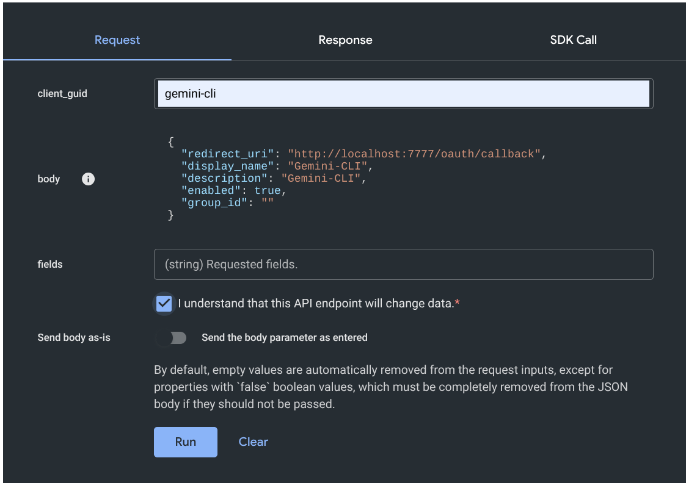
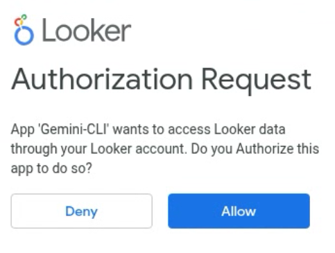
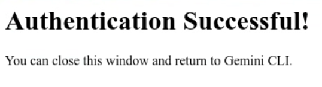

## Overview

Gemini-CLI can be configured to get an OAuth token from Looker, then send this
token to MCP Toolbox as part of the request. MCP Toolbox can then use this token
to authentincate with Looker. This means that there is no need to get a Looker
Client ID and Client Secret. This also means that MCP Toolbox can be set up as a
shared resource.

This configuration requires Toolbox v0.14.0 or later.

## Step 1: Register the OAuth App in Looker

You first need to register the OAuth application. Refer to the documentation
[here](https://cloud.google.com/looker/docs/api-cors#registering_an_oauth_client_application).
You may need to ask an administrator to do this for you.

1. Go to the API Explorer application, locate "Register OAuth App", and press
   the "Run It" button.
1. Set the `client_guid` to "gemini-cli".
1. Set the `redirect_uri` to "http://localhost:7777/oauth/callback".
1. The `display_name` and `description` can be "Gemini-CLI" or anything
   meaningful.
1. Set `enabled` to "true".
1. Check the box confirming that you understand this API will change data.
1. Click the "Run" button.

    

## Step 2: Install and configure Toolbox

In this section, we will download Toolbox and run the Toolbox server.

1. Download the latest version of Toolbox as a binary:

    
   Select the
   [correct binary](https://github.com/googleapis/genai-toolbox/releases)
   corresponding to your OS and CPU architecture.
    
    <!-- {x-release-please-start-version} -->
    ```bash
    export OS="linux/amd64" # one of linux/amd64, darwin/arm64, darwin/amd64, or windows/amd64
    curl -O https://storage.googleapis.com/genai-toolbox/v0.27.0/$OS/toolbox
    ```
    <!-- {x-release-please-end} -->

1. Make the binary executable:

    ```bash
    chmod +x toolbox
    ```

1. Create a file `looker_env` with the settings for your
   Looker instance.

   ```bash
    export LOOKER_BASE_URL=https://looker.example.com
    export LOOKER_VERIFY_SSL=true
    export LOOKER_USE_CLIENT_OAUTH=true
   ```

   In some instances you may need to append `:19999` to
   the LOOKER_BASE_URL.

1. Load the looker_env file into your environment.

   ```bash
   source looker_env
   ```

1. Run the Toolbox server using the prebuilt Looker tools.

    ```bash
    ./toolbox --prebuilt looker
    ```

    The toolbox server will begin listening on localhost port 5000. Leave it
    running and continue in another terminal.

    Later, when it is time to shut everything down, you can quit the toolbox
    server with Ctrl-C in this terminal window.

## Step 3: Configure Gemini-CLI

1. Edit the file `~/.gemini/settings.json`. Add the following, substituting your
   Looker server host name for `looker.example.com`.

    ```json
    "mcpServers": {
        "looker": {
            "httpUrl": "http://localhost:5000/mcp",
            "oauth": {
                "enabled": true,
                "clientId": "gemini-cli",
                "authorizationUrl": "https://looker.example.com/auth",
                "tokenUrl": "https://looker.example.com/api/token",
                "scopes": ["cors_api"]
            }
        }
    }
    ```

    The `authorizationUrl` should point to the URL you use to access Looker via the
    web UI. The `tokenUrl` should point to the URL you use to access Looker via
    the API. In some cases you will need to use the port number `:19999` after
    the host name but before the `/api/token` part.

1. Start Gemini-CLI.

1. Authenticate with the command `/mcp auth looker`. Gemini-CLI will open up a
   browser where you will confirm that you want to access Looker with your
   account.

   

   

1. Use Gemini-CLI with your tools.

## Using Toolbox as a Shared Service

Toolbox can be run on another server as a shared service accessed by multiple
users. We strongly recommend running toolbox behind a web proxy such as `nginx`
which will provide SSL encryption. Google Cloud Run is another good way to run
toolbox. You will connect to a service like `https://toolbox.example.com/mcp`.
The proxy server will handle the SSL encryption and certificates. Then it will
foward the requests to `http://localhost:5000/mcp` running in that environment.
The details of the config are beyond the scope of this document, but will be
familiar to your system administrators.

To use the shared service, just change the `localhost:5000` in the `httpUrl` in
`~/.gemini/settings.json` to the host name and possibly the port of the shared
service.
