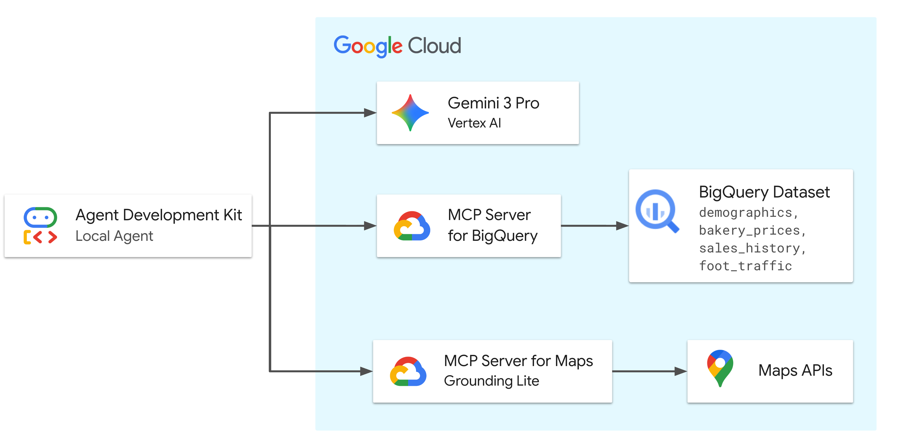

# Launch My Bakery: Google remote MCP demo 

[](https://cloud.google.com/blog/products/ai-machine-learning/announcing-official-mcp-support-for-google-services)
[](https://codelabs.developers.google.com/adk-mcp-bigquery-maps#0)
[](https://www.youtube.com/watch?v=wzccErUYhTI&t=1s)

This directory contains the data artifacts and infrastructure setup scripts for the **MCP support for BigQuery & Google Maps** demo.  

## Demo Overview

This scenario demonstrates an AI Agent's ability to orchestrate enterprise data (BigQuery) and real-world geospatial context (Google Maps) to solve a complex business problem: 

> **"How would you help a friend launch a new high-end sourdough bakery in Los Angeles?"**

The agent autonomously queries BigQuery to find macro trends and uses Google Maps to validate micro-location details. The demo relies on three key datasets:

1.  **Demographics:** To identify neighborhoods with high foot traffic using census data (Macro Discovery).
2.  **Market Data:** To analyze competitor pricing and suggest a premium price point (Pricing Strategy).
3.  **Sales History:** To forecast potential revenue based on comparable store trends (Forecasting).

### Architecture Diagram



The diagram above illustrates the flow of information in this demo. The Agent, powered by Gemini 3 Pro Preview, orchestrates requests between the user and Google Cloud services. It uses a remote (Google hosted) MCP server to securely access BigQuery for demographic and sales data, and Google Maps APIs for real-world location analysis and validation.

## Repository Structure

```text
launchmybakery/
├── data/                        # Pre-generated CSV files for BigQuery
│   ├── demographics.csv
│   ├── bakery_prices.csv
│   ├── sales_history_weekly.csv
│   └── foot_traffic.csv
├── adk_agent/                   # AI Agent Application (ADK)
│   └── mcp_bakery_app/          # App directory
│       ├── agent.py             # Agent definition
│       └── tools.py             # Custom tools for the agent
├── setup/                       # Infrastructure setup scripts
│   ├── setup_bigquery.sh        # Script to provision BigQuery dataset and tables
│   └── setup_env.sh             # Script to set up environment variables
├── cleanup/                     # Infrastructure clean up environment
│   ├── cleanup_env.sh           # Script to remove resources in environment
└── README.md                    # This documentation
```

## Prerequisites

*   **Google Cloud Project** with billing enabled.
*   **Google Cloud Shell** (Recommended) or a local terminal with the `gcloud` CLI installed.

## Deployment Guide

Follow these steps in **Google Cloud Shell** to provision the demo environment.

### 1. Clone the Repository
```bash
git clone https://github.com/google/mcp.git
cd mcp/examples/launchmybakery
```

### 2. Authenticate with Google Cloud

Run the following command to authenticate with your Google Cloud account. This is required for the ADK to access BigQuery.

```bash
gcloud config set project [YOUR-PROJECT-ID]
gcloud auth application-default login
```

Follow the prompts to complete the authentication process.

⚠️ Note: ADK does not automatically refresh your OAuth 2.0 token. If your chat session lasts more than 60 minutes, you may need to re-authenticate using the command above.

### 3. Configure Environment

Run the environment setup script. This script will:
*   Enable necessary Google Cloud APIs (Maps, BigQuery, remote MCP).
*   Create a restricted Google Maps Platform API Key.
*   Create a `.env` file with required environment variables.

```bash
chmod +x setup/setup_env.sh
./setup/setup_env.sh
```

### 4. Provision BigQuery

Run the setup script. This script automates the following:
*   Creates a Cloud Storage bucket.
*   Uploads the CSV data files.
*   Creates the `mcp_bakery` BigQuery dataset.
*   Loads the data into BigQuery tables.

```bash
chmod +x ./setup/setup_bigquery.sh
./setup/setup_bigquery.sh
```

### 5. Install ADK and Run Agent

Create a virtual environment, install the ADK, and run the agent.

```bash
# Create virtual environment
python3 -m venv .venv

# If the above fails, you may need to install python3-venv:
# apt update && apt install python3-venv

# Activate virtual environment
source .venv/bin/activate

# Install ADK
pip install google-adk

# Navigate to the app directory
cd adk_agent/

# Run the ADK web interface
adk web
```

### 6. Chat with the Agent

Open the link provided by `adk web` in your browser. You can now chat with the agent and ask it questions about the bakery data.

**Sample Questions:**

*   "I’m looking to open my fourth bakery location in Los Angeles. I need a neighborhood with early activity. Find the zip code with the highest 'morning' foot traffic score."
*   "Can you search for 'Bakeries' in that zip code to see if it's saturated? If there are too many, check for 'Specialty Coffee' shops, so I can position myself near them to capture foot traffic."
*    "Okay and I want to position this as a premium brand. What is the maximum price being charged for a 'Sourdough Loaf' in the LA Metro area?"
*    "Now I want a revenue projection for December 2025. Look at my sales history and take data from my best performing store for the 'Sourdough Loaf'. Run a forecast for December 2025 to estimate the quantity I'll sell. Then, calculate the projected total revenue using just under the premium price we found (let's use $18)"
*    "That'll cover my rent. Lastly, let's verify logistics. Find the closest "Restaurant Depot" to the proposed area and make sure that drive time is under 30 minutes for daily restocking."

### 7. Cleanup

To avoid incurring ongoing costs for BigQuery storage or other Google Cloud resources, you can run the cleanup script. This script will delete the BigQuery dataset, the Cloud Storage bucket, and the API keys created during setup. Navigate back to the root directory of the repository and run the following command:

```bash
chmod +x cleanup/cleanup_env.sh
./cleanup/cleanup_env.sh
```

## Data Logic & Narratives

The data in this repository is synthetic but structured to support specific demo narratives and successful agent reasoning chains.

| Table | Demo Purpose | Narrative Logic |
| :--- | :--- | :--- |
| **`foot_traffic`** | **Target Discovery**<br>Finding the target neighborhood. | **Morning** activity is uniquely spiked in **90403**, allowing the Agent to pinpoint it as the optimal location for a morning-focused business like a bakery. |
| **`demographics`** | **Community Profiling**<br>Analyzing market depth. | **Santa Monica (90403)** is modeled with a dense, established residential population, providing a stable baseline for customer volume. |
| **`bakery_prices`** | **Pricing Strategy**<br>Setting a price point. | **Erewhon Market** has the highest price ceiling for a Sourdough Loaf (~$18.50), while the market average is ~$8.20. This allows the Agent to confidently suggest a premium price point of ~$15-18. |
| **`sales_history`** | **Forecasting**<br>Predicting growth. | **Silver Lake** shows aggressive week-over-week growth trends, while **Playa Vista** represents a stable, high-volume flagship store, providing distinct patterns for forecasting models. |
